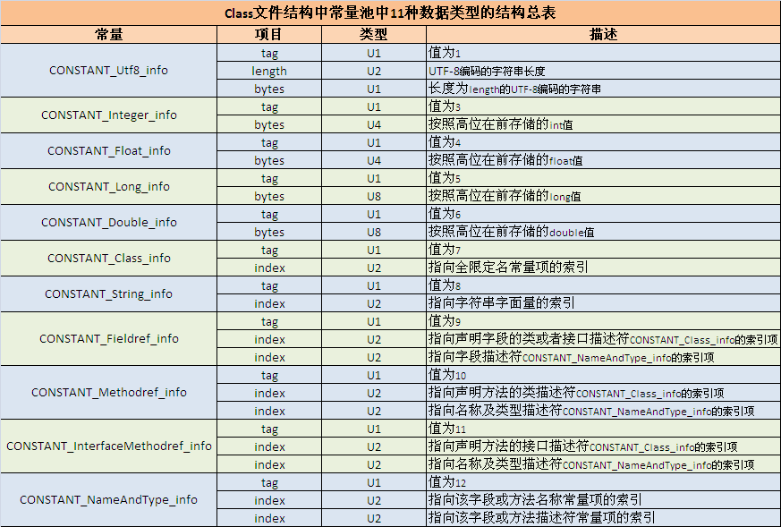

### Class 文件的结构

class 文件分为：MagicNumber, Version, Constant_pool, Access_flag, This_class，Super_class, interface, Fields, Methods 
和 Attributes 这十个部分， 用一个数据结构可以表示如下：


1、magic 

  在class文件开头的四个字节， 存放着class文件的魔数， 这个魔数是class 文件的标志，他是一个固定的值：0xCAFEBABE. 就是说它是判断一个文件
是否是class 格式的文件的标准，如果开头四字节不是0xCAFEBABE, 那么就说明它不是class文件，不能别JVM识别。


2、minor_version 和 major_version

  紧跟着魔数4字节是class文件的此版本号和主版本号。随着Java的发展, class 文件的格式也会做相应的变动。版本号标志着class文件在什么时候，加入
  或改变了哪些特征，举例来说，不同版本的javac 编译器编译的class文件，版本号可能不同，而不同版本的JVM能识别的class文件的笨笨好也可能不同，
  一般情况下，高版本的JVM能识别低版本的javac编译器的class文件，而低版本的JVM不能识别高版本的javac编译的class文件。如果使用低版本的JVM执行
  高版本的class文件，JVM会抛出java.lang.UnsupportedClassVersionError。
  
  
3、 constant_pool  




```
0A        // tag 10 表示这是一个CONSTANT_Methodref_info结构 
00 04     // class_index 指向常量池中第四个常量所表示的类
00 11     // name_and_type_index 指向常量池中第17个常量所表示的方法
```

