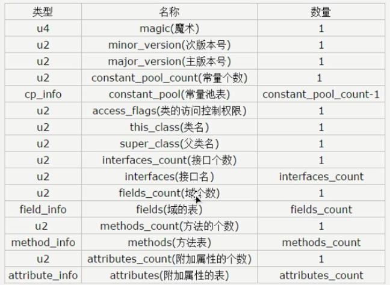

### ByteCode  


1. 使用 javap -verbose 命令分析一个字节码文件时， 将会分析该字节码文件的魔数、版本号、常量池、类信息、类的构造方法、类中的方法信息、
类变量与成员变量等信息。

2. 魔数： 所有的.class 字节码文件的前4个字节都是魔数，魔数为固定值: 0xCAFEBABE

3. 魔数之后的4个字节是版本信息，前两个字节表示 minor version (次版本号), 后2个字节表示major version (主版本号)。这里的版本号 00 00 00 34
换算成十进制表， 表示次版本号为0, 主版本号为 52. 所以该文件的版本号为 1.8.0。可以通过 java -version 来验证这一点。

4. 常量池 （constant pool）: 紧接着主版本号之后的就是常量池入口。一个java 类中定义的很多信息都是由常量池来描述的，可以将常量池看作是 Class
文件的资源仓库，比如说Java类中变量的方法与变量信息，都是存储在常量池中。常量池中主要存储2类常量：字面量与符号引用。
    * 字面量, 如字符串文本，java 中声明为final 的常量值等。
    * 符号引用, 如类和接口的全局限定名， 字段的名称和描述符，方法的名称和描述符等。

5. 常量池的总体结构： Java类所对应的常量池主要由常量池（常量表）的数量与常量池数组这两部分共同构成。常量池数量紧跟着在主版本号后面，占据2字节: 常量池
数组则紧跟着常量池数量之后。常量池数组与一般数组不同的是， 常量池数组中不同的元素的类型，结构都是不同的。长度当然也就不同；但是，一种元素的第一种
元素的第一个数据都是一个u1类型, 该字节是一个标识位，占据1个字节。 JVM在解析常量池时，会更具这个u1 类型来获取元素的具体类型。值得注意的是
常量池中元素的个数 = 常量池数 -1 (其中0暂时不适用), 目的是满足某些常量池索引值的数据在特定情况下需要表达【不引用任何一个常量池】的含义：
根本原因在于，索引为0也是一个常量（保留常量），只不过他不位于常量表中。这个常量就对应null值， 所以常量池的索引是从1开始而非0开始。

常量池数据结构表


上面表中描述了11种数据类型的机构， 其实在jdk1.7之后又增加了3种（CONSTANT_MethodHandle_info, CONSTANT_MethodType_info 以及
 CONSTANT_MethodType_info 以及CONSTANT_InvokeDynami_info）。这样一共14种。

6. 在JVM规范中， 每个变量/字段都有描述信息， 描述信息主要的作用是描述字段的数据类型、方法的参数列表（包括数量、类型、顺序）与返回值。根据描述符
规则， 基本数据类型和代表无返回值的的void 类型都用一个大写字符来表示， 对象类型则使用字符L加对象的全限定名称来表示。为了压缩字节码文件的体积
对于基本数据类型，JVM都只使用一个大写字母聊表示，如下所示：B-byte, C-char, D-double, F-float, I-int, J-long, S-short, Z-boolean , V -void
L -表示对象类型，如： Ljava/lang/String;
 
7. 对于数组类型来说，每一个维度使用一个前置的 [来表示， 如int[] 被标记为 [I , String[][]被表示为 [[java/lang/String;

8. 用描述符描述方法时, 按照先参数列表， 后返回值的顺序来描述. 参数列表按照参数的严格顺序放在一组()内， 如方法: 
String getRealnameByIdNickname(int id, String name)的描述符为: (I, Ljava/lang/String;) Ljava/lang/String 

字节码整体结构




完整Java 字节码结构


* Class 字节码中有两种数据类型
  * 字节数据直接量： 这是基本的数据类型。共细分为u1、u2、u4、u8四种，分别代表连续的1个字节、2个字节、4个字节、8个字节组成的整体数据。
  * 表（数组）：表时由多个基本数据或其他表，按照既定顺序组成的大的数据集合。表是有结构的 。它的结构体现在：组成表的成分所在的位置和顺序都是
严格定义好的。

Java 字节码整体结构


* Access_Flag 访问标志
  0x 00 21: 表示是0x0020 和0x0001的并集, 表示ACC_PUBLIC与ACC_SUPER
 
* 字段表用于庙宇类的接口汇总声明的变量。这里的字段包括了类级别变量以及实例变量, 但是不包括方法内部声明的局部变量。

* 字段表集合, fields_count: u2


* 字段表结构
```
    field_info {
        u2 access_flags; 0002
        u2 name_index; 0005
        u2 descriptor_index; 0006
        u2 attributes_count; 0000
        attribute_info attributes[attributes_count]
    }
```

* 方法表
methods_count: u2


* 方法表结构
前三个字段和field_info一样
```
    method_info {
        u2 access_flags;
        u2 name_index;
        u2 descriptor_index;
        u2 attributes_count;
        attributes_info attributes[attributes_count]
    }
```

* 方法属性结构
```
    attribute_info {
        u2 attribute_name_index;
        u4 attribute_length;
        u1 info[attribute_length];
    }
```