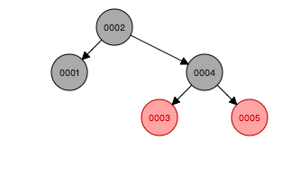
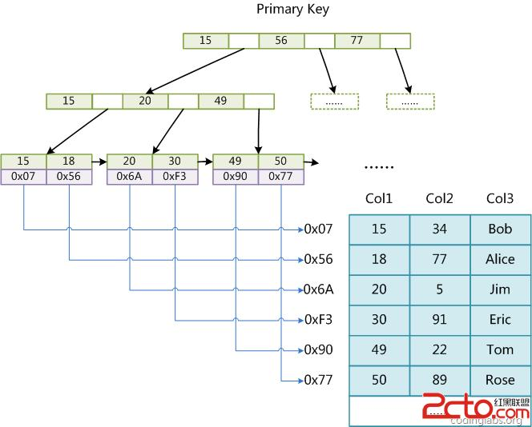

# 索引

### 索引的本质

* 索引是帮助 MySQL 高效获取的**高效排序**的**数据结构**
* 索引数据结构
  * 二叉树（对于数组 {1,2,3,4,5} 数据结构将成为了链表）
  
  
  
  * 红黑树（问题在于树的节点可能存在非常多的层次，会导致查找深度问题）
  
  
  * Hash表
  * B-Tree

### B-Tree

* 节点具体有相同的深度，叶子节点的指针为空

* 所有索引元素不重复

* 节点的数据索引从左到右递增排序

* 查询 Innodb_page_size

  ```mysql
  show global status like 'Innodb_page_size';
  -- 结果: 16k		
  ```

### B+Tree（B-Tree变种）

* 非叶子节点不存储data, 只存储索引（冗余），可以放更多的索引。
* 叶子节点包含所有的索引字段
* 叶子节点用指针连接，提高区间访问性能

###  索引文件和数据文件分离的（非聚集性）



### InnoDB 索引实现（聚集）

* 表数据文件本省就是按 B+Tree 组织的一个索引结构文件
* 聚集索引-叶子节点包含了完整的数据记录
* 为什么InnoDb 表必须有主键，并且推荐使用整型的自增主键？
  * 表数据文件按照 B+Tree 的数据结构维护，在叶子节点维护的是该行的数据。所以必须有主键。
  * 整型更方便B+Tree排序，自增的话，对于数据结构的存放更快。
* 为什么非主键索引结构叶子节点的存储的是主键值？（一致性和节省存储空间）

### 索引最左前缀原理

* 联合索引的底层存储结构是什么样子？

  