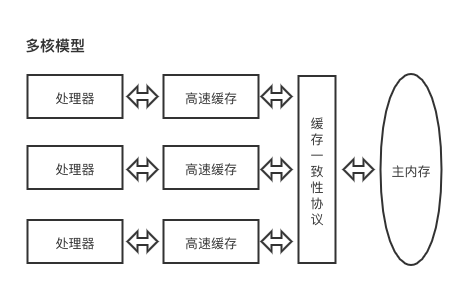
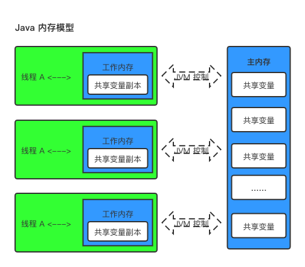
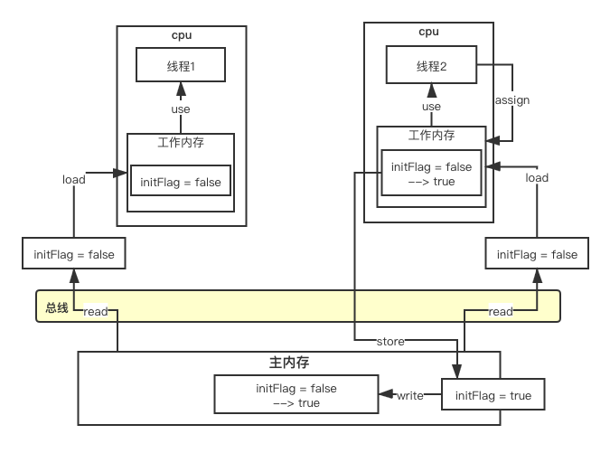

# JMM内存模型

### 多核架构


### JMM 内存模型

Java 线程模型跟 CPU缓存模型类似，是基于CPU 缓存模型来建立的，JAVA 线程内存模型是标准化的，屏蔽掉了底层不同的计算机的区别。



### JMM 数据原子操作

* read (读取）: 从主内存读取数据
* load (载入): 将主内存读取到数据写入工作内存
* use (使用): 从工作内存读取数据来计算
* assign (赋值): 将计算结果重新赋值到工作内存中
* store (存储): 将工作内存写入主内存中
* write (写入): 将 store 过去的变量赋值给主内存中的变量
* lock (锁定): 将准内存变量枷锁，标识为线程独占状态
* unlock (解锁):  将主内存变量解锁，解锁后其他线程可以锁定该变量。

### 数据原子操作实例

多线程访问一块内存区域示例如下：

```java
public class VolatileVisbilitTest {
  private static volatile boolean initFlag = true;
  
  public static void main(String[] args) {
    new Thread(() -> {
      System.out.println("wating data ...");
      while(!initFlag) {
        
      }
      System.out.println("=============== success");
    }).start();
    
    Thread.sleep(2000);
    
		new Thread(() -> {
      System.out.println("prepareing data ...");
      initFlag = true;
      System.out.println("prepare data end ...")
    }).start();
  }
}
```
Java 内存模型操作如下




### JMM 缓存不一致的问题

* 总线加锁

  CPU 从主存中读取数据拿到高速缓存，会在总线上对这个数据加锁，这样其他CPU 没办法去读取这个数据，知道这个CPU使用完数据释放锁之后CPU 才能读取到该数据

* MESI缓存一致协议

  多个 CPU 从内存读取同一个数据到各自的高速缓存，当其中某个CPU修改了缓存里的数据，该数据会马上同步回主内存，其他CPU通过**总线嗅探机制**可以感知到数据的变化从而将自己缓存的数据失效。

