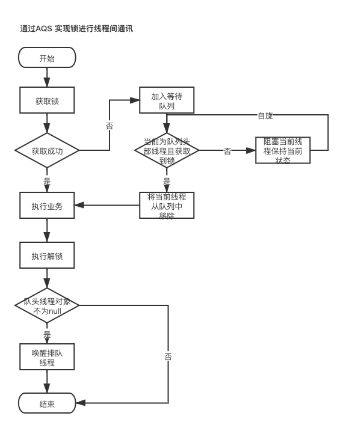

### AQS 同步器

### ### AQS 框架基本特征与结构

Java 并发包当中大多数同步器实现都是为围绕着共同的基础行为，比如等待队列、条件队列、独占获取、共享获取等，这个行为抽的抽象就是基于 AbstractQueuedSynchronizer 简称 AQS。AQS 是一个抽象同步框架，可以用来实现一个 <font color ="red"> 依赖状态</font> 的同步器。

AQS所具备的条件

* 阻塞等待队列
* 共享/独占
* 公平/非公平
* 可重入
* 允许中断

### 通过AQS保证并发线程安全

实现过程入下图所示



### AQS 的实现 Demo

* Lock 类的实现

```java
import cn.edu.cqvie.util.UnsafeInterface;
import lombok.SneakyThrows;
import sun.misc.Unsafe;

import java.util.concurrent.ConcurrentLinkedDeque;
import java.util.concurrent.locks.LockSupport;

public class Lock {

    private volatile int state = 0;
    private Thread lockHolder;
    /**
     * CLH 的变种
     */
    private ConcurrentLinkedDeque<Thread> waiters = new ConcurrentLinkedDeque<>();
		
  	//... 省略 getter和setter方法 
  
    private boolean acquire() {
        Thread current = Thread.currentThread();
        int c = getState();
        // 当前同步器没有持有锁
        if (c == 0) {
            // 当队列长度为 0 或者当前线程位于队列头部
            if ((waiters.size() == 0 || current == waiters.peek()) && compareAndSwapState(0, 1)) {
                setLockHolder(current);
                return true;
            }
        }
        return false;
    }

    @SneakyThrows
    public void lock() {
        // 1. 如果获取到锁返回
        if (acquire()) {
            return;
        }
        // 2. 获取锁失败将其添加到队列
        Thread current = Thread.currentThread();
        waiters.add(current);

        // 3. 自旋重复获取锁
        for (; ; ) {
            //是否是头部线程，如果加锁成功在队列中移除当前线程对象
            if (current == waiters.peek() && acquire()) {
                waiters.poll();
                break;
            }
            //阻塞当前线程，保持线程对当前的引用
            LockSupport.park(current);
        }
    }


    public void unlock() {
        Thread current = Thread.currentThread();
        if (getLockHolder() != current) {
            throw new RuntimeException("lockholder is not current thread");
        }

        // 1. 解锁
        int state = getState();
        if (compareAndSwapState(state, 0)) {
            setLockHolder(null);
            // 2. 唤醒排队线程第一个线程
            Thread peek = waiters.peek();
            if (peek != null) {
                LockSupport.unpark(peek);
            }
        }
    }

    /**
     * 原子操作 (CAS)
     *
     * @param except
     * @param update
     * @return
     */
    public final boolean compareAndSwapState(int except, int update) {
        return unsafe.compareAndSwapInt(this, stateOffset, except, update);
    }

    private static final Unsafe unsafe = UnsafeInterface.reflectGetUnsafe();
    private static final long stateOffset;

    static {
        long state = 0;
        try {
            assert unsafe != null;
            state = unsafe.objectFieldOffset(Lock.class.getDeclaredField("state"));
        } catch (Exception e) {
            e.printStackTrace();
        }
        stateOffset = state;
    }
}
```


* 测试类代码如下

  ```java
  import lombok.SneakyThrows;
  
  import java.util.concurrent.ExecutorService;
  import java.util.concurrent.Executors;
  
  public class LockTest {
  
      private static volatile int a = 5;
  
      @SneakyThrows
      public static void main(String[] args) {
          ExecutorService service = Executors.newCachedThreadPool();
  
          Lock lock = new Lock();
          for (int i = 0; i < 10; i++) {
              service.submit(() -> {
                  try {
                      lock.lock();
                      a--;
                      if (a >= 0) {
                          Thread.sleep(5);
                          System.out.println(Thread.currentThread().getName() + ": 恭喜你获得库存，秒杀成功。 index: " + a);
                      } else {
                          System.err.println(Thread.currentThread().getName() + ": 对不起库存不足，秒杀失败。");
                      }
                  } catch (Exception e) {
                      e.printStackTrace();
                  } finally {
                      lock.unlock();
                  }
              });
          }
          service.shutdown();
          while (!service.isTerminated()) {
              Thread.sleep(10);
          }
      }
  }
  
  ```

  

* Unsafe 实例获取方法

  ```java
      @SneakyThrows
      public static Unsafe reflectGetUnsafe() {
          final PrivilegedExceptionAction<Unsafe> action = () -> {
              Field theUnsafe = Unsafe.class.getDeclaredField("theUnsafe");
              theUnsafe.setAccessible(true);
              return (Unsafe) theUnsafe.get(null);
          };
          return AccessController.doPrivileged(action);
      }
  ```

  

