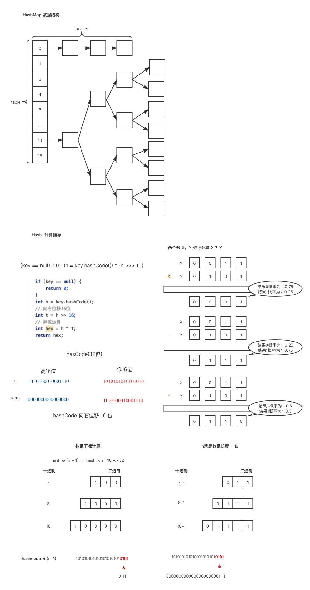

# HashMap 详解

### 数组

使用一段连续存单元存储数据。对于指定下标的查找，事件复杂度为 O(1)， 对于一般插入删除操作，涉及到数组元素的移动，其平均复杂度为O(n)。

* 顺序表，物理上连续；逻辑上连续，大小可以动态增加 ``ArrayList``
  * 查找快，删除慢
* 链表,  物理上不连续；逻辑上连续；可以动态增加和删除 ``LinkedList``
  * 删除和增加快，对于非连续的查询慢

### 红黑树

红黑树：一种既定凭很二叉搜索树，在每个结点上增加一个存储位表示结点的颜色，可以是Red 或 Black ， 通过

对任意一条从根到叶子的路径上各个节点着色方式的限制，红黑树确保没有一条路径会比其他路径长出2倍，因而是接近平衡的。

支持查找、插入、删除等操作，其气平均时间复杂度最坏为 O(logn)

红黑树的5个性质：

* 每个节点要么是红的要么是黑的

* 根节点是黑的

* 每个叶节点（叶节点即指树尾端NIL 指针或NULL节点）都是黑的。

* 如果一个节点是红的，那么他的两个儿子节点都是黑的

* 对于任意节点而言，其道叶结点树尾端NIL指针的每条路径都包含相同数目的黑节点

入下图所示：


### HashMap 数据结构原理

* java 7 , 它是一个数组 + 链表的结构
  
  * 链表头插入法
  
* java 8 , 它是一个数组 + 链表 + 红黑树

* 默认初始容量是16

* 容量值必须是2的指数次幂

  如： 

  ```
  13 -> 16 2^4
  7  -> 8
  3  -> 4
  ```

* hash 计算的方式和避免hash冲突

  * 通过采用<font color="red">位运算</font>来进行定位数组的下标，而不是咱们常理解的取模运算，因为位运算的时间复杂度要低。
  * 确定下标： ``h & (length -1) [0-15]`` 必须数组长度是2的指数次幂
  * 如果集合中元素较多，在触发拓容的时候会存在多次hash计算，位运算能够有效的提升效率。 
  
* 通过位移来计算hashCode 的值的目的是为了让元素在集合中更加的均匀分布

* HashMap 中链表与红黑树转换的阈值为什么是6和8？

  * 链表长度 超过8  JDK1.8  链表转换为红黑树

  * 红黑树 节点<6 红黑树转换成链表

    处于查找时间的考虑,  JDK 1.

    * 链表 n 的查找复杂度 O(n) 
    * 红黑树 n 的查找复杂度 O(log n)

### HashMap 拓容

* HashMap拓容的过程, 默认长度为 16 。

* Java 8 中链表长度为 8 的时候转换为红黑树，在 6 的时候就会转换回链表。
  * <font color="red">当集合的总长度小于64 的时候会优先选择拓容，让当大于等于64的时候才选择转红黑树 </font>
  * 链表转红黑树阈值 = 8，实际链表的长度为 9 
  
* 负载因子为什么默认值是 0.75f ，是为了时间和空间的一个平衡。

### HashMap 特征

* JDK 1.7 和 JDK 1.8 对比

  * JDK 1.8 链表 -> 红黑树

  *  头插法， JDK 1.7 ， JDK1.8 尾插法

* 多线程不是线程安全的

### 数据结构和hash计算推导

