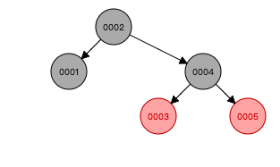

# HashMap 详解

### 数组

使用一段连续存单元存储数据。对于指定下标的查找，事件复杂度为 O(1)， 对于一般插入删除操作，涉及到数组元素的移动，其平均复杂度为O(n)。

### 红黑树

红黑树：一种既定凭很二叉搜索树，在每个结点上增加一个存储位表示结点的颜色，可以是Red 或 Black ， 通过

对任意一条从根到叶子的路径上各个节点着色方式的限制，红黑树确保没有一条路径会比其他路径长出2倍，因而是接近平衡的。

支持查找、插入、删除等操作，其气平均时间复杂度最坏为 O(logn)

红黑树的5个性质：

* 每个节点要么是红的要么是黑的

* 根节点是黑的

* 每个叶节点（叶节点即指树尾端NIL 指针或NULL节点）都是黑的。

* 如果一个节点是红的，那么他的两个儿子节点都是黑的

* 对于任意节点而言，其道叶结点树尾端NIL指针的每条路径都包含相同数目的黑节点

入下图所示：

### HashMap 数据结构原理

### HashMap 拓容

### 线程安全类 ConcurrentHashMap