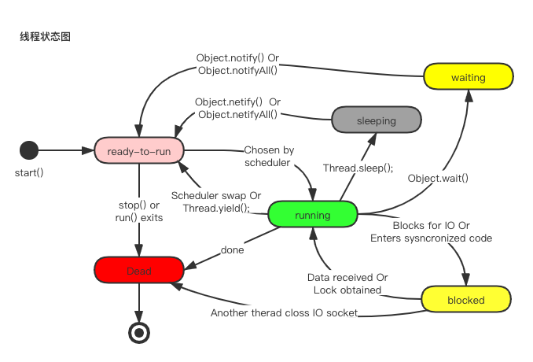

# Java 线程

### 线程生命周期

### 线程池的意义

线程是稀缺资源，他的创建与销毁是一个相对偏重且耗资源的操作，而 Java 线程依赖于内核线程，创建线程需要进行操作系统状态切换，为避免资源过度消耗需要设法重用线程执行多个任务。线程池就是一个线程缓存，负责对线程进行统一分配、调优与监控。

* 什么时候需要创建线程池？
  * 单个任务处理时间比较短
  * 需要处理的任务数量很大
* 线程池的优势
  * 重用存在的线程，减少线程创建，消亡的开销，提高性能。
  * 提高响应速度。当任务达到时，任务可以不需要的等到线程创建就能立即执行
  * 提高线程的可管理性，可统一分配，调优和监控。
* 线程次执行过程如下图所示

### 线程池的5种状态

* **Running**

  能接受新任务以及处理已经填卡的任务

* **Shutdown**

  不接受新任务，可以处理已经添加的任务

* **Stop**

  不接受新任务，不处理已经太耐的任务，并且中断正在处理的任务

* **Tidying**

  所有的任务已经终止， ctl 记录的 “任务数量” 为0， ctl 负责记录线程次的运行状态与活动线程数量。

* **Terminated**

  线程池彻底终止，则线程池转变为termiated 状态

如下图所示

