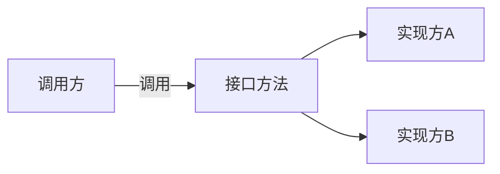

# Servlet3.x 规范

### SPI 介绍

SPI 全称为（Service Provider Interface）, 是JDK内置的一种服务发现机制。SPI 是一种动态替换的发现机制，比如一个接口，想运行时动态给它添加一个实现。我们经常遇到的就是 ``java.sql.Driver`` 接口，其他不同厂商可以针对同一接口做出不同实现，mysql 和 postgresql 都有不同的实现提供给用户，而 Java 的 SPI 机制可以为讴歌接口寻找到实现类。

咱们具体实现的步骤如下。

* 当服务的提供者提供了一种接口的实现之后，需要在classpath下的META-INF/services/目录里创建一个以服务接口命名的文件，这个文件里的内容就是这个接口的具体的实现类。
* 当其他的程序需要这个服务的时候，就可以通过查找这个jar包（一般都是以jar包做依赖）的META-INF/services/中的配置文件，配置文件中有接口的具体实现类名，可以根据这个类名进行加载实例化，就可以使用该服务了。
* JDK中查找服务实现的工具类是：java.util.ServiceLoader。

### SPI 示例

我们在服务提供者提供一个待实现接口 ``cn.edu.cqvie.HDriver``

每个继承实现新的SPI类，我们都在一个特别命名的目录中创建一个映射文件 ``META-INF/services`` 文件的名称是要子类化的SPI类的名称， 并且文件包含SPI抽象了IDE子类的名称

我们创建文件

​	``META-INF/services/``cn.edu.cqvie.HDriver``

包括内容

​	``net.cqive.enterprise.MyHDriver``

### Servlet 3.0 新特征

* 异步处理支持： 有了该特征，Servlet 线程不再需要一直被阻塞，知道业务处理完毕才能输出响应，最后才结束Servlet线程。在接受到请求之后，Servlet 线程可以将耗时操作委派给另一个线程来完成。自己在不生成响应的情况下返回至容器。针对业务处理比较耗时的情况，这个将大大减少服务器资源占用，并且提升处理速度。
* 新增的注解支持：该版本新增了若干注解，用于简化 Servlet、过滤器（Filter）和监听器（Listener）的声明，这使得 web.xml 部署描述文件从该版本开始不再是必选的了。
* 可插性支持：熟悉 Struts2 的开发者一定会对其通过插件的方式与包括 Spring 在内的各种常用框架的整合特性记忆犹新。将相应的插件封装成 JAR 包并放在类路径下，Struts2 运行时便能自动加载这些插件。现在 Servlet 3.0 提供了类似的特性，开发者可以通过插件的方式很方便的扩充已有 Web 应用的功能，而不需要修改原有的应用。

