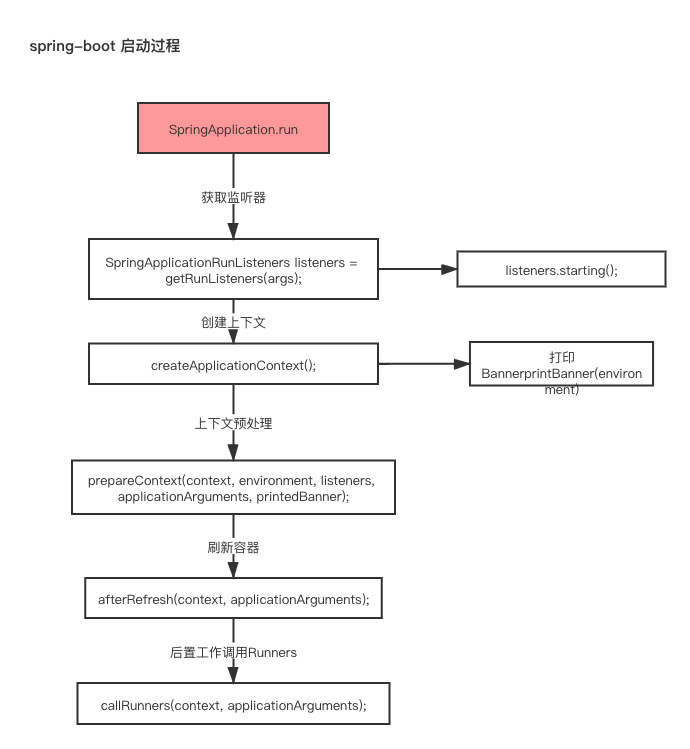

# spring-boot 启动过程

### 加入spring-boot 启动依赖的配置

```xml
<!--spring-boot-loader 直接打包到Jar中-->
<dependency>
  <groupId>org.springframework.boot</groupId>
  <artifactId>spring-boot-loader</artifactId>
</dependency>
```


### spring boot 启动过程

