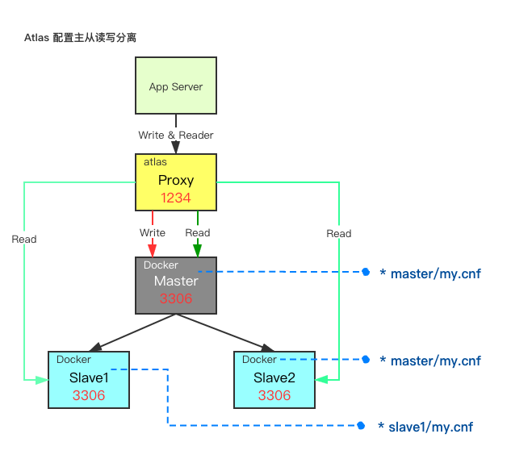

# Docker 构建 MySQL 主从架构

### mysql-cluster 架构图



### mysql-cluster配置

* ``master`` 节点 ``my.cnf`` 配置

```properties
[mysqld]
server-id=99
# bin log 文件前缀
log-bin=mysql-bin
# 对应要同步的数据库
binlog-do-db=ssm

# 不需要同步的数据库
binlog-ignore-db=information_schema
binlog-ignore-db=mysql
binlog-ignore-db=personalsite
binlog-ignore-db=test

```

* ``slave`` 节点 ``my.cnf`` 配置

```properties
[mysqld]
server-id=1
# 非必须
log-bin=mysql-bin
# 需要同步的数据
replicate-do-db=ssm

# 不需要同步的数据库
replicate-ignore-db=information_schema
replicate-ignore-db=mysql
replicate-ignore-db=personalsite
replicate-ignore-db=test
                     
```

* ``slave`` 节点初始化 ``sql`` 文件

```shell
# 动态的配置，主节点连接信息
change master to master_host='master', master_user='root', master_password='123456';
reset slave;
start slave;

# 关闭 slave 服务
# stop slave
# 查询状态
# show slave status;
```


### docker-compose.yml 配置

```yml
# 这个version是指dockerfile解析时用的版本,不是给我们自己定义版本号用的.
version: '3.3'
services:
  master:
    image: mysql:5.7.29
    # 设置环境变量
    environment:
      MYSQL_ROOT_PASSWORD: 123456
    ports:
      - "12347:3306"
    # 挂载 下边每行前边的`-`代表这个东西是数组的一个元素.就是说volumes属性的值是一个数组
    volumes:
      - "./master/my.cnf:/etc/mysql/conf.d/my.cnf"
  slave1:
    image: mysql:5.7.29
    environment:
      MYSQL_ROOT_PASSWORD: 123456
    ports:
      - "12348:3306"
    volumes:
      - "./slave1/my.cnf:/etc/mysql/conf.d/my.cnf"
      - "./slave1/:/docker-entrypoint-initdb.d/"
    depends_on:
      - master
    links:
      - master
  slave2:
    image: mysql:5.7.29
    environment:
      MYSQL_ROOT_PASSWORD: 123456
    ports:
      - "12349:3306"
    volumes:
      - "./slave2/my.cnf:/etc/mysql/conf.d/my.cnf"
      - "./slave2/:/docker-entrypoint-initdb.d/"
    depends_on:
      - master
    links:
      - master
  atlas:
    image: atlas
    ports:
      - "12346:1234"
    volumes:
      - "./Atlas/log/:/usr/local/mysql-proxy/log/"
      - "./Atlas/conf/test.cnf:/usr/local/mysql-proxy/conf/test.cnf"
    depends_on:
      - master
      - slave1
      - slave2
    links:
      - master
      - slave1
      - slave2

```


### Atlas构建镜像DockerFile

```dockerfile
FROM centos:7

VOLUME /tmp

# Atlas 下载地址 https://github.com/Qihoo360/Atlas/releases/download/2.2.1/Atlas-2.2.1.el6.x86_64.rpm
ADD Atlas-2.2.1.el6.x86_64.rpm Atlas.rpm

RUN rpm -i Atlas.rpm

#运行 Atlas
CMD /usr/local/mysql-proxy/bin/mysql-proxyd test start
```


### Atlas 的环境配置文件

我们在构建镜像的过程中采用的是``test``环境我们需要添加一个test.cnf

```properties
[mysql-proxy]

#带#号的为非必需的配置项目

#管理接口的用户名
admin-username = user

#管理接口的密码
admin-password = pwd

#Atlas后端连接的MySQL主库的IP和端口，可设置多项，用逗号分隔
proxy-backend-addresses = master:3306

#Atlas后端连接的MySQL从库的IP和端口，@后面的数字代表权重，用来作负载均衡，若省略则默认为1，可设置多项，用逗号分隔
proxy-read-only-backend-addresses = slave1:3306@1,slave2:3306@2

#用户名与其对应的加密过的MySQL密码，密码使用PREFIX/bin目录下的加密程序encrypt加密，下行的user1和user2为示例，将其替换为你的MySQL的用户名和加密密码！
#pwds = user1:+jKsgB3YAG8=, user2:GS+tr4TPgqc=
pwds = root:/iZxz+0GRoA=

#设置Atlas的运行方式，设为true时为守护进程方式，设为false时为前台方式，一般开发调试时设为false，线上运行时设为true,true后面不能有空格。
daemon = true

#设置Atlas的运行方式，设为true时Atlas会启动两个进程，一个为monitor，一个为worker，monitor在worker意外退出后会自动将其重启，设为false时只有worker，
#没有monitor，一般开发调试时设为false，线上运行时设为true,true后面不能有空格。
keepalive = true

#工作线程数，对Atlas的性能有很大影响，可根据情况适当设置
event-threads = 8

#日志级别，分为message、warning、critical、error、debug五个级别
log-level = message
#日志存放的路径
log-path = /usr/local/mysql-proxy/log

#SQL日志的开关，可设置为OFF、ON、REALTIME，OFF代表不记录SQL日志，ON代表记录SQL日志，REALTIME代表记录SQL日志且实时写入磁盘，默认为OFF
sql-log = REALTIME

#慢日志输出设置。当设置了该参数时，则日志只输出执行时间超过sql-log-slow（单位：ms)的日志记录。不设置该参数则输出全部日志。
#sql-log-slow = 10

#实例名称，用于同一台机器上多个Atlas实例间的区分
instance = test

#Atlas监听的工作接口IP和端口
proxy-address = 0.0.0.0:1234

#Atlas监听的管理接口IP和端口
admin-address = 0.0.0.0:2345

#分表设置，此例中person为库名，mt为表名，id为分表字段，3为子表数量，可设置多项，以逗号分隔，若不分表则不需要设置该项
#tables = person.mt.id.3

#默认字符集，设置该项后客户端不再需要执行SET NAMES语句
charset = utf8

#允许连接Atlas的客户端的IP，可以是精确IP，也可以是IP段，以逗号分隔，若不设置该项则允许所有IP连接，否则只允许列表中的IP连接
#client-ips = 127.0.0.1, 192.168.1

#Atlas前面挂接的LVS的物理网卡的IP(注意不是虚IP)，若有LVS且设置了client-ips则此项必须设置，否则可以不设置
#lvs-ips = 192.168.1.1

```

