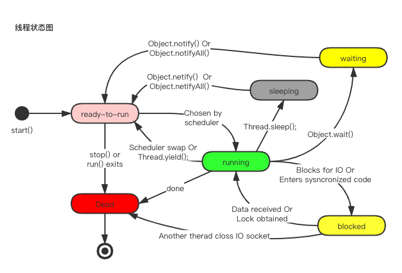

### 线程的状态
* 初始化
* 准备运行状态（就绪）
* 运行中（抢占到CPU）
  * 等待状态（调用 Object.wait() , 唤醒 Object.notify() Or Object.notifyAll()）
    一直等待等待
  * 阻塞状态
    Data received Or Lock obatined
  * 休眠状态（Thread.sleep(), 唤醒 Object.notify() Or Object.notifyAll()）
    Sleep 是一个超时等待，时间到了，就会自动进入就绪状态等待CPU资源。
* 终止（Dead）
* 线程状态如下图所示
