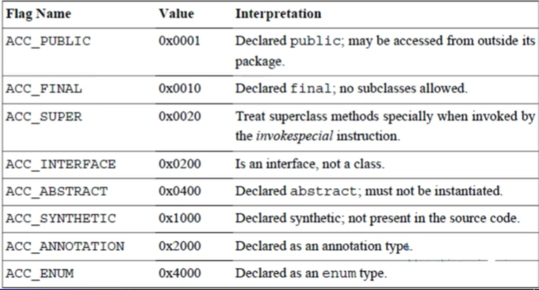

### ByteCode  

1. 使用 javap -verbose 命令分析一个字节码文件时， 将会分析该字节码文件的魔数、版本号、常量池、类信息、类的构造方法、类中的方法信息、
类变量与成员变量等信息。

2. 魔数： 所有的.class 字节码文件的前4个字节都是魔数，魔数为固定值: 0xCAFEBABE

3. 版本信息，魔数之后的4个字节是版本信息，前两个字节表示 minor version (次版本号), 后2个字节表示major version (主版本号)。这里的版本号 00 00 00 34
换算成十进制表， 表示次版本号为0, 主版本号为 52. 所以该文件的版本号为 1.8.0。可以通过 java -version 来验证这一点。

4. 常量池 （constant pool）: 2+N个字节 紧接着主版本号之后的就是常量池入口。一个java 类中定义的很多信息都是由常量池来描述的，可以将常量池看作是 Class
文件的资源仓库，比如说Java类中变量的方法与变量信息，都是存储在常量池中。常量池中主要存储2类常量：字面量与符号引用。
    * 字面量, 如字符串文本，java 中声明为final 的常量值等。
    * 符号引用, 如类和接口的全局限定名， 字段的名称和描述符，方法的名称和描述符等。

5. 常量池的总体结构： Java类所对应的常量池主要由常量池（常量表）的数量与常量池数组这两部分共同构成。常量池数量紧跟着在主版本号后面，占据2字节: 常量池
数组则紧跟着常量池数量之后。常量池数组与一般数组不同的是， 常量池数组中不同的元素的类型，结构都是不同的。长度当然也就不同；但是，一种元素的第一种
元素的第一个数据都是一个u1类型, 该字节是一个标识位，占据1个字节。 JVM在解析常量池时，会更具这个u1 类型来获取元素的具体类型。值得注意的是
常量池中元素的个数 = 常量池数 -1 (其中0暂时不适用), 目的是满足某些常量池索引值的数据在特定情况下需要表达【不引用任何一个常量池】的含义：
根本原因在于，索引为0也是一个常量（保留常量），只不过他不位于常量表中。这个常量就对应null值， 所以常量池的索引是从1开始而非0开始。

常量池数据结构表


上面表中描述了11种数据类型的机构， 其实在jdk1.7之后又增加了3种（CONSTANT_MethodHandle_info, CONSTANT_MethodType_info 以及
 CONSTANT_MethodType_info 以及CONSTANT_InvokeDynami_info）。这样一共14种。

6. 在JVM规范中， 每个变量/字段都有描述信息， 描述信息主要的作用是描述字段的数据类型、方法的参数列表（包括数量、类型、顺序）与返回值。根据描述符
规则， 基本数据类型和代表无返回值的的void 类型都用一个大写字符来表示， 对象类型则使用字符L加对象的全限定名称来表示。为了压缩字节码文件的体积
对于基本数据类型，JVM都只使用一个大写字母聊表示，如下所示：B-byte, C-char, D-double, F-float, I-int, J-long, S-short, Z-boolean , V -void
L -表示对象类型，如： Ljava/lang/String;
 
7. 对于数组类型来说，每一个维度使用一个前置的 [来表示， 如int[] 被标记为 [I , String[][]被表示为 [[java/lang/String;

8. 用描述符描述方法时, 按照先参数列表， 后返回值的顺序来描述. 参数列表按照参数的严格顺序放在一组()内， 如方法: 
String getRealnameByIdNickname(int id, String name)的描述符为: (I, Ljava/lang/String;) Ljava/lang/String 

字节码整体结构


完整Java 字节码结构


* Class 字节码中有两种数据类型
  * 字节数据直接量： 这是基本的数据类型。共细分为u1、u2、u4、u8四种，分别代表连续的1个字节、2个字节、4个字节、8个字节组成的整体数据。
  * 表（数组）：表时由多个基本数据或其他表，按照既定顺序组成的大的数据集合。表是有结构的 。它的结构体现在：组成表的成分所在的位置和顺序都是
严格定义好的。

Java 字节码整体结构


* Access_Flag 访问标志
  访问标识信息包括该Class文件时类和接口是否被定义成了public，是否是 abstract, 
如果是类，是否被申明为成final。通过扇面的源代码。
  
  0x 00 21: 表示是0x0020 和0x0001的并集, 表示ACC_PUBLIC与ACC_SUPER


* 字段表用于描述类的接口汇总声明的变量。这里的字段包括了类级别变量以及实例变量, 但是不包括方法内部声明的局部变量。

* 字段表集合, fields_count: u2


* 字段表结构
```
    field_info {
        u2 access_flags; 0002
        u2 name_index; 0005 (表示字段名称在常量池中的索引位置)
        u2 descriptor_index; 0006 (描述符索引)
        u2 attributes_count; 0000
        attribute_info attributes[attributes_count]
    }
```

* 方法表
methods_count: u2


* 方法表结构
前三个字段和field_info一样
```
    method_info {
        u2 access_flags; 0001
        u2 name_index; 0017
        u2 descriptor_index; 0018
        u2 attributes_count; 0001
        attributes_info attributes[attributes_count]
    }
```

* 方法属性结构
```
    attribute_info {
        u2 attribute_name_index; 0019
        u4 attribute_length; 000051
        u1 info[attribute_length];
    }
```

"Code" 表示下面是执行代码

JVM 预定义了一部分的attribute, 但是编译器自己也可以实现自己的attribute 写入class文件中， 供运行时使用。
不同的attribute 通过attribute_name_index 来区分。


* JVM 规范预定义的attribute


* Code 结构

Code attribute 的作用是保存该放的的结构，如所对应的字节码
```
Code_attribute {
    u2 attribute_name_index; 
    u4 attribute_length;
    u2 max_stack;
    u4 code_length;
    u1 code[code_lenght];
    u2 exception_table_length;
    {
        u2 start_pc;
        u2 end_pc;
        u2 handler_pc;
        u2 catch_type;
    } exception_table[exception_table_lenght];
    u2 attributes_count;
    attribute_info attributes[attributes_count];
}
``` 

  * attribute_length 表示 attribute 所包含的字节数， 不包含attribute_name_index 和 attribute_length 字段。
    
  * max_stack 表示这个方法运行的任何时刻锁能达到的操作数栈的最大深度。
    
  * max_locals 表示方法执行期间创建的局部变量的数目，包含用来表示传入的参数的局部变量。
    
  * code_length 表示该方法所包含的字节码的字节数以及具体的指令码。
    
  * 具体字节码即是该方法被调用时，虚拟机所执行的字节码。
    
  * exception_table, 这里存放的是处理异常信息。
    
  * 每个 exception_table, 这里存放的是处理异常的信息。
    
    * 每个 exception_table 表项由start_pc , end_pc, handler_pc, catch_type 组成。
   
    * start_pc 和 end_pc 表示在code数组中的从 start_pc 到 end_pc 处（包含start_pc, 不包含end_pc）的指令抛出的异常会由
    这个表项来处理。
    
    * handler_pc 表示处理异常的代码的开始处。catch_type 表示会被处理的异常类型， 它指向常量池里的一个异常类。 当catch_type为0时, 
    表示处理所有的异常。  
  
    * LineNumberTable 的结构
    ```
    LineNumberTable_attribute {
        u2 attribute_name_index;
        u4 attribute_lenght;
        u2 line_number_table_length;
        {
            u2 start_pc;
            u2 line_number;
        }
        line_number_table[line_number_table_length];
    }
    ```
    
### 总结

1. 构造方法中会初始化成员属性的默认值，如果自己实现了默认的构造方法， 依然还是在构造方法中赋值，这就是对指令的重排序。
2. 如果多个构造方法那么每个构造方法中都有初始化成员变量的属性，来保障每个构造方法初始化的时候都会执行到属性的初始化过程。
3. 如果构造方法中有执行语句, 那么会先执行赋值信息, 然后在执行自定义的执行代码。
4. 对于Java每一个实例方法(非静态方法), 其在编译后生成的字节码中比实际方法多一个参数, 它位于方法的第一个参数位置. 我们就可以在当前方法中
的this去访问当前对象中的this这个操作是在Javac 编译器在编译期间将this的访问转换为对普通实例方法的参数访问，接下来在运行期间，
由JVM的调用实例方法时， 自动向实例方法中传入该this参数， 所以在实例方法的局部变量表中， 至少会一个指向当前对象的局部变量。
5. 字节码对于处理异常的方式：
  * 统一采用异常表的方式来对异常处理。
  * 在Jdk1.4.2之前的版本中， 并不是使用异常表的方式来对异常进行处理的，而是采用特定的指令方式。
  * 当异常处理存在finally 语句块时，现代化的JVM才去的处理方式将finally语句块的自己吗拼接到每一个catch块后面, 换句话说，程序中中存在多个catch
块，就会在每一个catch块后面重复多少个finally 的语句块字节码。