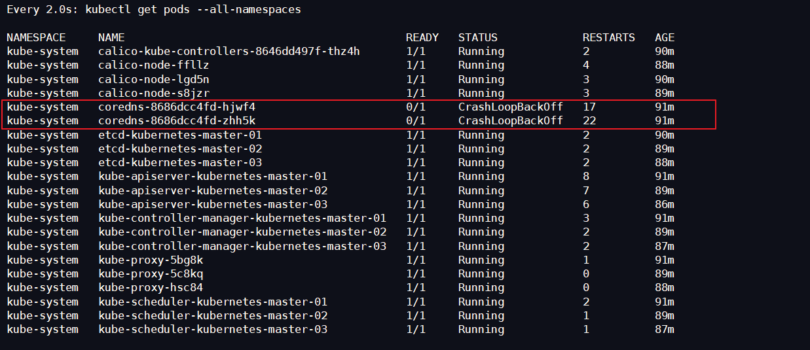

# Kubernetes 不能加入Node节点

## 问题描述

当我们使用 `kubeadm join` 命令将 Node 节点加入集群时，你会发现所有 `kubectl` 命令均不可用（呈现阻塞状态，并不会返回响应结果），我们可以在 Node 节点中通过 `kubeadm reset` 命令将 Node 节点下线，此时回到 Master 节点再使用 `watch kubectl get pods --all-namespaces` 可以看到下图中报错了，`coredns-xxx-xxx` 状态为 `CrashLoopBackOff`



## 解决方案

从上面的错误信息不难看出应该是出现了网络问题，而我们在安装过程中只使用了一个网络插件 **Calico** ，那么该错误是不是由 Calico 引起的呢？带着这个疑问我们去到 Calico 官网再看一下它的说明，官网地址：https://docs.projectcalico.org/v3.7/getting-started/kubernetes/

在它的 Quickstart 里有两段话（属于特别提醒），如下：

todo

上面这段话的主要意思是：当 `kubeadm` 安装完成后不要关机，继续完成后续的安装步骤；这也说明了安装 Kubernetes 的过程不要出现中断一口气搞定（不过这不是重点）(*￣rǒ￣)

todo

上面这段话的主要意思是：如果你的网络在 `192.168.0.0/16` 网段中，则必须选择一个不同的 Pod 网络；恰巧咱们的网络范围（我虚拟机的 IP 范围是 `192.168.141.0/24`）和该网段重叠 (ノへ￣、)；好吧，当时做单节点集群时因为没啥问题而忽略了 ♪(^∇^*)

so，能够遇到这个问题主要是因为虚拟机 IP 范围刚好和 Calico 默认网段重叠导致的，所以想要解决这个问题，咱们就需要修改 Calico 的网段了（当然也可以改虚拟机的），换句话说就是大家重装一下 o (一︿一 +) o

**按照以下标准步骤重装即可**

## 重置 Kubernetes

```shell
kubeadm reset

# 输出如下
[reset] WARNING: Changes made to this host by 'kubeadm init' or 'kubeadm join' will be reverted.
[reset] Are you sure you want to proceed? [y/N]: y
[preflight] Running pre-flight checks
W0604 01:55:28.517280   22688 reset.go:234] [reset] No kubeadm config, using etcd pod spec to get data directory
[reset] No etcd config found. Assuming external etcd
[reset] Please manually reset etcd to prevent further issues
[reset] Stopping the kubelet service
[reset] unmounting mounted directories in "/var/lib/kubelet"
[reset] Deleting contents of stateful directories: [/var/lib/kubelet /etc/cni/net.d /var/lib/dockershim /var/run/kubernetes]
[reset] Deleting contents of config directories: [/etc/kubernetes/manifests /etc/kubernetes/pki]
[reset] Deleting files: [/etc/kubernetes/admin.conf /etc/kubernetes/kubelet.conf /etc/kubernetes/bootstrap-kubelet.conf /etc/kubernetes/controller-manager.conf /etc/kubernetes/scheduler.conf]

The reset process does not reset or clean up iptables rules or IPVS tables.
If you wish to reset iptables, you must do so manually.
For example:
iptables -F && iptables -t nat -F && iptables -t mangle -F && iptables -X

If your cluster was setup to utilize IPVS, run ipvsadm --clear (or similar)
to reset your system's IPVS tables.
```

## 删除 kubectl 配置

```shell
rm -fr ~/.kube/
```

## 启用 IPVS

```shell
modprobe -- ip_vs
modprobe -- ip_vs_rr
modprobe -- ip_vs_wrr
modprobe -- ip_vs_sh
modprobe -- nf_conntrack_ipv4
```

## 导出修改配置文件

```shell
kubeadm config print init-defaults --kubeconfig ClusterConfiguration > kubeadm.yml
```

配置文件修改如下

```shell
apiVersion: kubeadm.k8s.io/v1beta2
bootstrapTokens:
- groups:
  - system:bootstrappers:kubeadm:default-node-token
  token: abcdef.0123456789abcdef
  # Token 永不过期
  ttl: 0s
  usages:
  - signing
  - authentication
kind: InitConfiguration
localAPIEndpoint:
  # 修改主节点IP
  advertiseAddress: 192.168.1.100
  bindPort: 6443
nodeRegistration:
  criSocket: /var/run/dockershim.sock
  name: k8s-master01
  taints:
  - effect: NoSchedule
    key: node-role.kubernetes.io/master
---
apiServer:
  timeoutForControlPlane: 4m0s
apiVersion: kubeadm.k8s.io/v1beta2
certificatesDir: /etc/kubernetes/pki
clusterName: kubernetes
# 配置 Keepalived 地址和 HAProxy 端口
controlPlaneEndpoint: "192.168.1.200:6444"
controllerManager: {}
dns:
  type: CoreDNS
etcd:
  local:
    dataDir: /var/lib/etcd
# 国内不能访问 Google，修改为阿里云
imageRepository: registry.aliyuncs.com/google_containers
kind: ClusterConfiguration
kubernetesVersion: v1.18.0
networking:
  dnsDomain: cluster.local
  # 主要修改在这里，替换 Calico 网段为我们虚拟机不重叠的网段（这里用的是 Flannel 默认网段）
  podSubnet: "10.244.0.0/16"
  serviceSubnet: 10.96.0.0/12
scheduler: {}
---
# 开启 IPVS 模式
apiVersion: kubeproxy.config.k8s.io/v1alpha1
kind: KubeProxyConfiguration
featureGates:
  SupportIPVSProxyMode: true
mode: ipvs
```

## kubeadm 初始化

```shell
kubeadm init --config=kubeadm.yml --upload-certs | tee kubeadm-init.log

# 输出如下
[init] Using Kubernetes version: v1.18.5
....
Your Kubernetes control-plane has initialized successfully!

To start using your cluster, you need to run the following as a regular user:

  mkdir -p $HOME/.kube
  sudo cp -i /etc/kubernetes/admin.conf $HOME/.kube/config
  sudo chown $(id -u):$(id -g) $HOME/.kube/config

You should now deploy a pod network to the cluster.
Run "kubectl apply -f [podnetwork].yaml" with one of the options listed at:
  https://kubernetes.io/docs/concepts/cluster-administration/addons/

You can now join any number of the control-plane node running the following command on each as root:

  kubeadm join 192.168.1.200:6444 --token abcdef.0123456789abcdef \
    --discovery-token-ca-cert-hash sha256:a7ef74025ff79a2be52f5132d968c6b437bd986701fea033da34083adcff2a50 \
    --control-plane --certificate-key 902ab630a26d9521282f86c6352960010ad4c583d04d9fda625e86544583ea66

Please note that the certificate-key gives access to cluster sensitive data, keep it secret!
As a safeguard, uploaded-certs will be deleted in two hours; If necessary, you can use
"kubeadm init phase upload-certs --upload-certs" to reload certs afterward.

Then you can join any number of worker nodes by running the following on each as root:

kubeadm join 192.168.1.200:6444 --token abcdef.0123456789abcdef \
    --discovery-token-ca-cert-hash sha256:a7ef74025ff79a2be52f5132d968c6b437bd986701fea033da34083adcff2a50 
```

## 配置 kubectl

```shell
# 配置 kubectl
mkdir -p $HOME/.kube
cp -i /etc/kubernetes/admin.conf $HOME/.kube/config
chown $(id -u):$(id -g) $HOME/.kube/config

# 验证是否成功
kubectl get node
```

## 下载 Calico 配置文件并修改和安装

```shell
# 安装 Calico
kubectl apply -f https://docs.projectcalico.org/manifests/calico.yaml
wget https://docs.projectcalico.org/manifests/calico.yaml

#修改第 611 行，将 192.168.0.0/16 修改为 10.244.0.0/16，可以通过如下命令快速查找

#显示行号：:set number
#查找字符：/要查找的字符，输入小写 n 下一个匹配项，输入大写 N 上一个匹配项
# The default IPv4 pool to create on startup if none exists. Pod IPs will be
# chosen from this range. Changing this value after installation will have
# no effect. This should fall within `--cluster-cidr`.
		- name: CALICO_IPV4POOL_CIDR
			value: "10.244.0.0/16"
			
# 安装
kubectl apply -f calico.yaml

# 验证安装是否成功
configmap/calico-config unchanged
customresourcedefinition.apiextensions.k8s.io/bgpconfigurations.crd.projectcalico.org created
customresourcedefinition.apiextensions.k8s.io/bgppeers.crd.projectcalico.org created
customresourcedefinition.apiextensions.k8s.io/blockaffinities.crd.projectcalico.org created
customresourcedefinition.apiextensions.k8s.io/clusterinformations.crd.projectcalico.org configured
customresourcedefinition.apiextensions.k8s.io/felixconfigurations.crd.projectcalico.org configured
customresourcedefinition.apiextensions.k8s.io/globalnetworkpolicies.crd.projectcalico.org configured
customresourcedefinition.apiextensions.k8s.io/globalnetworksets.crd.projectcalico.org configured
customresourcedefinition.apiextensions.k8s.io/hostendpoints.crd.projectcalico.org configured
customresourcedefinition.apiextensions.k8s.io/ipamblocks.crd.projectcalico.org configured
customresourcedefinition.apiextensions.k8s.io/ipamconfigs.crd.projectcalico.org configured
customresourcedefinition.apiextensions.k8s.io/ipamhandles.crd.projectcalico.org configured
customresourcedefinition.apiextensions.k8s.io/ippools.crd.projectcalico.org configured
customresourcedefinition.apiextensions.k8s.io/kubecontrollersconfigurations.crd.projectcalico.org configured
customresourcedefinition.apiextensions.k8s.io/networkpolicies.crd.projectcalico.org configured
customresourcedefinition.apiextensions.k8s.io/networksets.crd.projectcalico.org configured
clusterrole.rbac.authorization.k8s.io/calico-kube-controllers unchanged
clusterrolebinding.rbac.authorization.k8s.io/calico-kube-controllers unchanged
clusterrole.rbac.authorization.k8s.io/calico-node unchanged
clusterrolebinding.rbac.authorization.k8s.io/calico-node unchanged
daemonset.apps/calico-node configured
serviceaccount/calico-node unchanged
deployment.apps/calico-kube-controllers unchanged
serviceaccount/calico-kube-controllers unchanged
```

## 加入 Master 节点

```shell
kubeadm join 192.168.1.200:6444 --token abcdef.0123456789abcdef \
    --discovery-token-ca-cert-hash sha256:a7ef74025ff79a2be52f5132d968c6b437bd986701fea033da34083adcff2a50 \
    --control-plane --certificate-key 902ab630a26d9521282f86c6352960010ad4c583d04d9fda625e86544583ea66
```


## 加入  Node 节点

```shell
kubeadm join 192.168.1.200:6444 --token abcdef.0123456789abcdef \
    --discovery-token-ca-cert-hash sha256:a7ef74025ff79a2be52f5132d968c6b437bd986701fea033da34083adcff2a50 
```


## 验证是否可用

```shell
kubectl get node

# 输出如下
NAME           STATUS   ROLES    AGE     VERSION
k8s-master01   Ready    master   6h11m   v1.18.6
k8s-master02   Ready    master   6h7m    v1.18.6
k8s-master03   Ready    master   5h56m   v1.18.5
k8s-slave01    Ready    <none>   5h46m   v1.18.5
k8s-slave02    Ready    <none>   5h42m   v1.18.5
k8s-slave03    Ready    <none>   5h42m   v1.18.5


# 输出如下
Every 2.0s: kubectl get pods --all-namespaces                                                                                                                          Sat Jul 18 18:10:23 2020

NAMESPACE     NAME                                       READY   STATUS    RESTARTS   AGE
kube-system   calico-kube-controllers-578894d4cd-8ccb4   1/1     Running   0          6h8m
kube-system   calico-node-c4m44                          1/1     Running   8          5h43m
kube-system   calico-node-fprcq                          1/1     Running   9          5h56m
kube-system   calico-node-llbv4                          1/1     Running   10         5h42m
kube-system   calico-node-mhk2f                          1/1     Running   0          6h8m
kube-system   calico-node-r22dt                          1/1     Running   4          6h8m
kube-system   calico-node-tl44q                          1/1     Running   8          5h47m
kube-system   coredns-7ff77c879f-thfl4                   1/1     Running   0          6h12m
kube-system   coredns-7ff77c879f-xmdsg                   1/1     Running   0          6h12m
kube-system   etcd-k8s-master01                          1/1     Running   4          6h12m
kube-system   etcd-k8s-master02                          1/1     Running   1          6h8m
kube-system   etcd-k8s-master03                          1/1     Running   6          5h56m
kube-system   kube-apiserver-k8s-master01                1/1     Running   4          6h12m
kube-system   kube-apiserver-k8s-master02                1/1     Running   3          6h8m
kube-system   kube-apiserver-k8s-master03                1/1     Running   11         5h56m
kube-system   kube-controller-manager-k8s-master01	     1/1     Running   6          6h12m
kube-system   kube-controller-manager-k8s-master02	     1/1     Running   3          6h8m
kube-system   kube-controller-manager-k8s-master03	     1/1     Running   4          5h56m
kube-system   kube-proxy-4x4gr                           1/1     Running   3          5h47m
kube-system   kube-proxy-78t4w                           1/1     Running   3          5h42m
kube-system   kube-proxy-8dlp9                           1/1     Running   3          5h56m
kube-system   kube-proxy-kwszn                           1/1     Running   0          6h12m
kube-system   kube-proxy-lr2ww                           1/1     Running   3          6h8m
kube-system   kube-proxy-v4j24                           1/1     Running   3          5h43m
kube-system   kube-scheduler-k8s-master01                1/1     Running   6          6h12m
kube-system   kube-scheduler-k8s-master02                1/1     Running   4          6h8m
kube-system   kube-scheduler-k8s-master03                1/1     Running   5          5h56m
```

