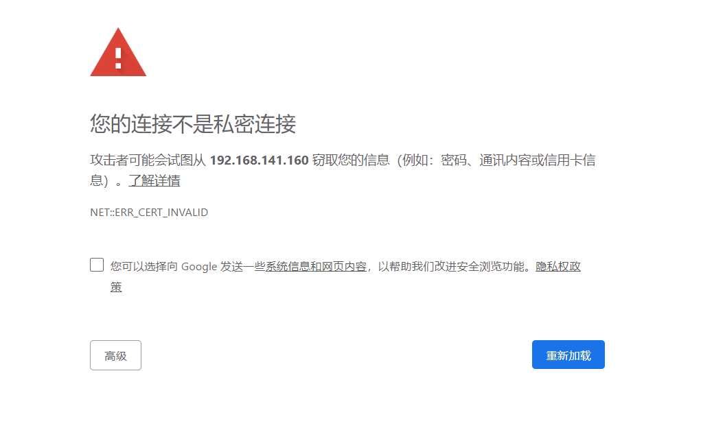

# Kubentes Dashboard

## 概述

Kubernetes Dashboard 是 Kubernetes 集群的 Web UI，用于管理集群。

## 安装

GitHub 地址：[Kubernetes Dashboard](https://github.com/kubernetes/dashboard)

下载配置文件

```shell
# wget https://raw.githubusercontent.com/kubernetes/dashboard/v2.0.3/aio/deploy/recommended.yaml
kubectl apply -f https://raw.githubusercontent.com/kubernetes/dashboard/v2.0.3/aio/deploy/recommended.yaml
```

修改配置如下

```shell
# 省略部分代码...

# ------------------- Dashboard Service ------------------- #

kind: Service
apiVersion: v1
metadata:
  labels:
    k8s-app: kubernetes-dashboard
  name: kubernetes-dashboard
  namespace: kube-system
spec:
  # 修改类型为 NodePort 访问
  type: NodePort
  ports:
    - port: 443
      targetPort: 8443
      # 设置端口号为 30001
      nodePort: 30001
  selector:
    k8s-app: kubernetes-dashboard
```

部署到集群

需要使用 NodeIP:30001 访问 Dashboard，因为证书原因除火狐浏览器外其它浏览器无法直接打开页面

Chrome 浏览器显示如下




Firefox 浏览器显示如下


点击 **接受风险并继续** 即可显示欢迎界面


## 登录

我们采用 Token 方式登录

- 创建登录账号，创建一个名为 `dashboard-adminuser.yaml` 的配置文件

```shell
apiVersion: v1
kind: ServiceAccount
metadata:
  name: admin-user
  namespace: kube-system
---
apiVersion: rbac.authorization.k8s.io/v1
kind: ClusterRoleBinding
metadata:
  name: admin-user
roleRef:
  apiGroup: rbac.authorization.k8s.io
  kind: ClusterRole
  name: cluster-admin
subjects:
- kind: ServiceAccount
  name: admin-user
  namespace: kube-system
```

```shell
kubectl create -f dashboard-adminuser.yaml
```

* 打印 Token 信息

```shell
kubectl -n kube-system describe secret $(kubectl -n kube-system get secret | grep admin-user | awk '{print $1}')

# 输出如下
Name:         admin-user-token-mw295
Namespace:    kubernetes-dashboard
Labels:       <none>
Annotations:  kubernetes.io/service-account.name: admin-user
              kubernetes.io/service-account.uid: 7bcb31bc-daab-492b-b6c7-4d0c0b1db6f8

Type:  kubernetes.io/service-account-token

Data
====
ca.crt:     1025 bytes
namespace:  20 bytes
token:      eyJhbGciOiJSUzI1NiIsImtpZCI6Ilk3ampVZGZYSzltVTNaS2gtTTVvc0pCUGpuODd3U0dKQVFKZEhDVExEbjAifQ.eyJpc3MiOiJrdWJlcm5ldGVzL3NlcnZpY2VhY2NvdW50Iiwia3ViZXJuZXRlcy5pby9zZXJ2aWNlYWNjb3VudC9uYW1lc3BhY2UiOiJrdWJlcm5ldGVzLWRhc2hib2FyZCIsImt1YmVybmV0ZXMuaW8vc2VydmljZWFjY291bnQvc2VjcmV0Lm5hbWUiOiJhZG1pbi11c2VyLXRva2VuLW13Mjk1Iiwia3ViZXJuZXRlcy5pby9zZXJ2aWNlYWNjb3VudC9zZXJ2aWNlLWFjY291bnQubmFtZSI6ImFkbWluLXVzZXIiLCJrdWJlcm5ldGVzLmlvL3NlcnZpY2VhY2NvdW50L3NlcnZpY2UtYWNjb3VudC51aWQiOiI3YmNiMzFiYy1kYWFiLTQ5MmItYjZjNy00ZDBjMGIxZGI2ZjgiLCJzdWIiOiJzeXN0ZW06c2VydmljZWFjY291bnQ6a3ViZXJuZXRlcy1kYXNoYm9hcmQ6YWRtaW4tdXNlciJ9.JOTCiswrmwu_t3XBhkfFtrjvzHIqjS9nzwSo_1BgfZbnKoEEhg1-I3qsJd-VEXZ-e4uyvNQChu0bmEz85ipcxTVmpDOULP6IvBUDEXbq_hP4WGt7t5EBrZPgADiLQ09THlgF_KQfv8jOoe93ILGP34VVGqlnbbnoD8UeIqPJGFC2XuMFwPKY7AzOCvCNAk9pdPkf4rgHzQqtZJulnvm0E_ZX8lcjLgsFVVlGVrddD8iqpWkwvnfLJ76dgjERdaxiJxKHVZduktJrfTFPZp0hnaUfxQuzS1kEqUXIA6Z7jIQhxhM0HnPhfEPWJmi477Cl-bDwh_JB6srUeQdTTx5Hdw
```

* 将 Token 输入浏览器，成功登陆后效果如下


