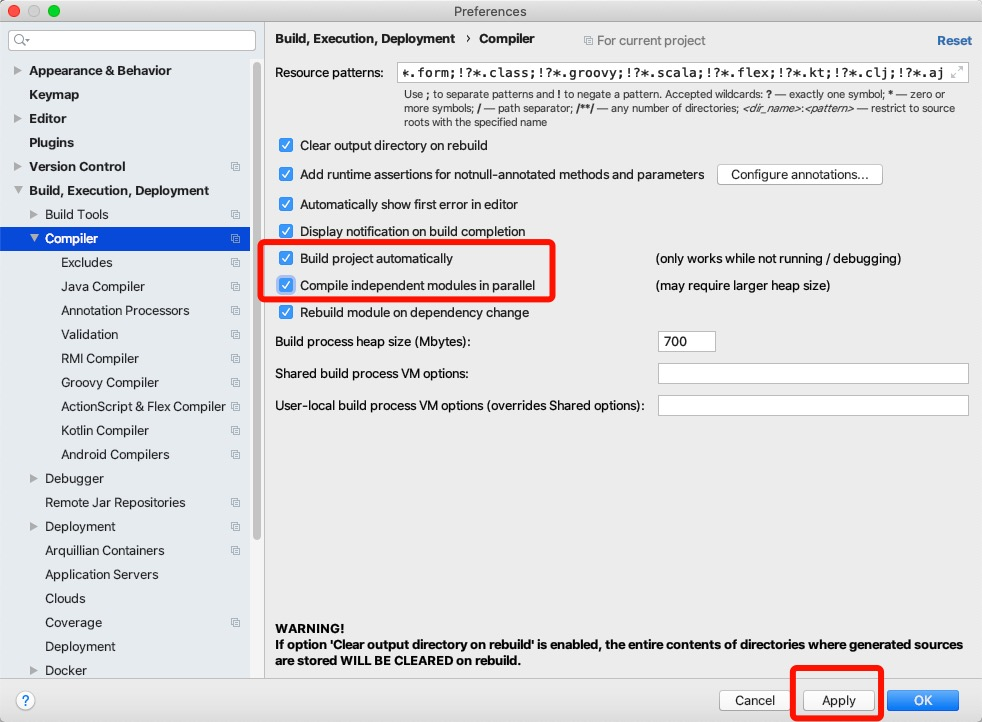
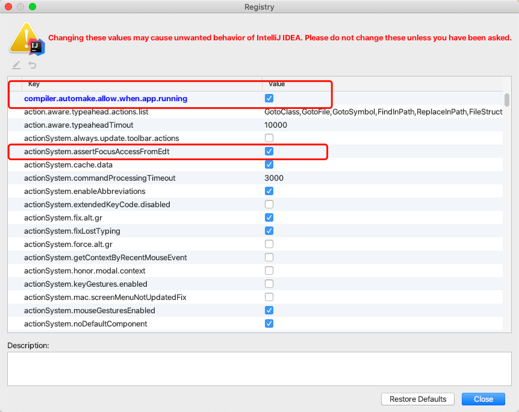

# spring-boot 热部署

## 描述

其实这个方式只是用来完成一个自动重启的工作(省去了手动重启的，并没有加快多少的速度)

## 操作过程

1. 添加 devtools 到项目

```xml
<dependency>
  <groupId>org.springframework.boot</groupId>
  <artifactId>spring-boot-devtools</artifactId>
  <scope>runtime</scope>
  <optional>true</optional>
</dependency>
```

2. 添加 plugin 到 pom.xml

```xml
<plugin>
  <groupId>org.springframework.boot</groupId>
  <artifactId>spring-boot-maven-plugin</artifactId>
  <configuration>
    <fork>true</fork>
    <addResources>true</addResources>
  </configuration>
</plugin>
```

3. 启动自动部署(IDEA 设置)

* Build,Excution, Deployment => Compiler( 可用快捷键 ``command + , ``) 启用 
  * Build project atuomatically
  * Compile independent modules in parailel 



3. 修改 IDEA 的系统设置

* 快捷键 ``command + shfit + alt + /``
* 勾选如下选项：
  * complier.automake.allow.when.app.running
  * actionSystem.assertFocusAccessFromEdt



4. 重启IDEA