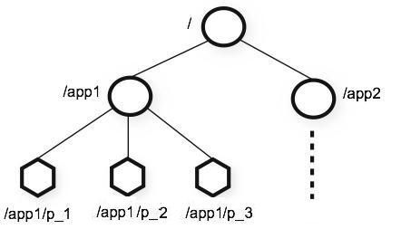

# Kafka 操作命令

### 操作命令

* 查询系统的所有 Topic
```shell script
# 获取所有的主题
./bin/kafka-topics.sh --list --zookeeper localhost:2181
# 或者
./bin/kafka-topics.sh --bootstrap-server localhost:9092 --list

# 结果
#__consumer_offsets
# myTopic

```
  * __consumer_offsets_x 是系统的主题，是判断消费者消费的偏移量，一同会有50 个分区映射到0-49
  * 一个主题会对应多个日志目录，每个文件夹对应着一个分区
  
* 创建一个 Topic
```shell script
# 创建一个myTopic 3个分区，且一个副本，并且注册中心为 localhost:2181
./bin/kafka-topics.sh --create --zookeeper localhost:2181 --topic yourTopic --replication-factor 1 --partitions 3
```

* 查询 Topic 的详细信息
```shell script
# 查询yourTopic主题的详细信息
./bin/kafka-topics.sh --describe --zookeeper localhost:2181 --topic yourTopic
# 返回结果
Topic: yourTopic	PartitionCount: 3	ReplicationFactor: 1	Configs: 
	Topic: yourTopic	Partition: 0	Leader: 0	Replicas: 0	Isr: 0
	Topic: yourTopic	Partition: 1	Leader: 0	Replicas: 0	Isr: 0
	Topic: yourTopic	Partition: 2	Leader: 0	Replicas: 0	Isr: 0
```

* 查询 Topic 所有的分区信息
```shell script

```

* 开启一个 Producer（生产者）
```shell script
./bin/kafka-console-producer.sh --broker-list localhost:9092 --topic yourTopic
```

* 创建一个 Consumer（消费者）
```shell script
# --from-beginning 可以消费历史数据
./bin/kafka-console-consumer.sh --bootstrap-server localhost:9092 --topic yourTopic --from-beginning
```

### Kafka主题

* topic (主题) 相关的脚本
  * bin/kafka-topics.sh
  * 观察参数输出提示
    * --bootstrap-server 与 --zookeeper
    
* 如果在发送消息时，所指定的主题并不存在，那么根据 Kafka 的配置，可能会有如下的两种情况发生。
  * Kafka Server 会报错，告诉发送者该主题不存在，需要先创建好主题后再发送消息。
  * Kafka Server 会自动创建所指定的主题，并将所发送的消息归类到所创建的这个主题下面。
   
* 之所以会有如上两种区别，关键在于Kafka的配置文件中的一个参数项：
  * auto.create.topic.enable = true

* 如果将该参数项指定为 true，那么在发送消息时，如果所指定的主题不存在，Kafka 就会帮我们自动创建该主题反之，则会报错。

* __consumer_offsets 是Kafka Server 所创建的用于标识消费者偏移量的主题（Kafka 中的消息都是顺序保存在磁盘上的，通过 offset 
偏移量来标识消息的顺序），它由Kafka Server 内部使用

* 如果想要查看某个具体主题（如yourTopic），执行如下命令即可
  ```shell script
  # 查询yourTopic主题的详细信息
  ./bin/kafka-topics.sh --describe --zookeeper localhost:2181 --topic yourTopic
  # 返回结果
  Topic: yourTopic	PartitionCount: 3	ReplicationFactor: 1	Configs: 
  	Topic: yourTopic	Partition: 0	Leader: 0	Replicas: 0	Isr: 0
  	Topic: yourTopic	Partition: 1	Leader: 0	Replicas: 0	Isr: 0
  	Topic: yourTopic	Partition: 2	Leader: 0	Replicas: 0	Isr: 0
  ```
  * 第一行显示出所有的分区信息（yourTopic 主题的分区数是3 ， 即在之前创建主题时所指定的 --partition 3 这个参数所确定的）的一个总结
  信息；后续的每一行则给出一个分区的信息，如果只有一个分区，那么就只会显示出一行，正如上述输出那样。
  
  * 上述第一行表示信息为：
    * 主题名：yourTopic
    * 分区数：3
    * 副本数：1
    
  * 第二行信息表示为：
    * 主题名：yourTopic
    * 当前分区：0
    * Leader Broker: 0
    * 副本：0
    * isr (in-sync replica): 0
    
* 还可以查看 Kafka Server 自己所创建的用于管理消息偏移量的主题：__consumer_offsets 的详细信息，执行如下命令
```shell script
./bin/kafka-topics.sh --describe --topic __consumer_offsets --zookeeper localhost:2181

```

* 执行结果可以看到，该主题有50个分区，副本数为1，同时也输出了相应的配置信息

* 从第二行开始，列出了每个分区的信息，分区从0到49。由于我们这里使用了单台 Kafka Server ,因此可以卡进到每个分区的 Leader 都是0
这表示每个分区的 Leader 都是同一台 Server，即我们所启动这台 Kafka Server . 

### Kafka 中的 Zookeeper

* 那么，这些主题都是保存在 Zookeeper 中的,  Kafka 是重度依赖Zookeeper 的， Zookeeper 保存了Kafka所需的元信息，以及关于主题、消息
偏移量等诸多信息，下面我们就到 Zookeeper 中插件一下相关的内容。

* 可以通过 Kafka 集成的 Zookeeper 客户端脚本来连接到 Zookeeper Server 上
  * ./zookeeper-shell.sh localhost:2181
 
* Zookeeper 命令执行
  * ls /
  * ls2 /
  * 上述命令除了会列出 Zookeeper 根（/）下面的所有节点外，还会额外输出其他相关的信息（可以任务ls2 命令是ls 命令的增强，ls2 命令相当于
  是 ls + stat 两个命令的集合体，而stat命令则是用于输出状态信息的。）
  
  * ls /config/topics
  * ls2 /config/topics
  * 该命令不仅输出了主题的名字，还输出了相关的统计信息，如创建时间、版本号等信息。
  
* Zookeeper 的本质是一种树形结构，有一个跟节点/ 。它下面可以有若干个子节点，子节点下面还可以有子节点，每个子节点有自己的属性等信息，其
结构如下图所示


* Zookeeper 是Kafka的得力助手，同时也是很多系统所依赖的底层协调框架。对于Zookeeper 来说，有很多图形化的客户端能以比较直观的方式列出
各个节点的信息，不过这里还是建议大家先掌握Zookeeper 的命令行操作方式，以加深对其掌握和理解。