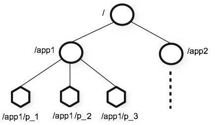

# Kafka 操作命令

### 操作命令

* 查询系统的所有 Topic
```shell script
# 获取所有的主题
./bin/kafka-topics.sh --list --zookeeper localhost:2181
# 或者
./bin/kafka-topics.sh --bootstrap-server localhost:9092 --list

# 结果
#__consumer_offsets
# myTopic

```
  * __consumer_offsets_x 是系统的主题，是判断消费者消费的偏移量，一同会有50 个分区映射到0-49
  * 一个主题会对应多个日志目录，每个文件夹对应着一个分区
  
* 创建一个 Topic
```shell script
# 创建一个myTopic 3个分区，且一个副本，并且注册中心为 localhost:2181
./bin/kafka-topics.sh --create --zookeeper localhost:2181 --topic yourTopic --replication-factor 1 --partitions 3
```

* 查询 Topic 的详细信息
```shell script
# 查询yourTopic主题的详细信息
./bin/kafka-topics.sh --describe --zookeeper localhost:2181 --topic yourTopic
# 返回结果
Topic: yourTopic	PartitionCount: 3	ReplicationFactor: 1	Configs: 
	Topic: yourTopic	Partition: 0	Leader: 0	Replicas: 0	Isr: 0
	Topic: yourTopic	Partition: 1	Leader: 0	Replicas: 0	Isr: 0
	Topic: yourTopic	Partition: 2	Leader: 0	Replicas: 0	Isr: 0
```

* 查询 Topic 所有的分区信息
```shell script

```

* 开启一个 Producer（生产者）
```shell script
./bin/kafka-console-producer.sh --broker-list localhost:9092 --topic yourTopic
```

* 创建一个 Consumer（消费者）
```shell script
# --from-beginning 可以消费历史数据
./bin/kafka-console-consumer.sh --bootstrap-server localhost:9092 --topic yourTopic --from-beginning
```

### Kafka主题

* topic (主题) 相关的脚本
  * bin/kafka-topics.sh
  * 观察参数输出提示
    * --bootstrap-server 与 --zookeeper
    
* 如果在发送消息时，所指定的主题并不存在，那么根据 Kafka 的配置，可能会有如下的两种情况发生。
  * Kafka Server 会报错，告诉发送者该主题不存在，需要先创建好主题后再发送消息。
  * Kafka Server 会自动创建所指定的主题，并将所发送的消息归类到所创建的这个主题下面。
   
* 之所以会有如上两种区别，关键在于Kafka的配置文件中的一个参数项：
  * auto.create.topic.enable = true

* 如果将该参数项指定为 true，那么在发送消息时，如果所指定的主题不存在，Kafka 就会帮我们自动创建该主题反之，则会报错。

* __consumer_offsets 是Kafka Server 所创建的用于标识消费者偏移量的主题（Kafka 中的消息都是顺序保存在磁盘上的，通过 offset 
偏移量来标识消息的顺序），它由Kafka Server 内部使用

* 如果想要查看某个具体主题（如yourTopic），执行如下命令即可
  ```shell script
  # 查询yourTopic主题的详细信息
  ./bin/kafka-topics.sh --describe --zookeeper localhost:2181 --topic yourTopic
  # 返回结果
  Topic: yourTopic	PartitionCount: 3	ReplicationFactor: 1	Configs: 
  	Topic: yourTopic	Partition: 0	Leader: 0	Replicas: 0	Isr: 0
  	Topic: yourTopic	Partition: 1	Leader: 0	Replicas: 0	Isr: 0
  	Topic: yourTopic	Partition: 2	Leader: 0	Replicas: 0	Isr: 0
  ```
  * 第一行显示出所有的分区信息（yourTopic 主题的分区数是3 ， 即在之前创建主题时所指定的 --partition 3 这个参数所确定的）的一个总结
  信息；后续的每一行则给出一个分区的信息，如果只有一个分区，那么就只会显示出一行，正如上述输出那样。
  
  * 上述第一行表示信息为：
    * 主题名：yourTopic
    * 分区数：3
    * 副本数：1
    
  * 第二行信息表示为：
    * 主题名：yourTopic
    * 当前分区：0
    * Leader Broker: 0
    * 副本：0
    * isr (in-sync replica): 0
    
* 还可以查看 Kafka Server 自己所创建的用于管理消息偏移量的主题：__consumer_offsets 的详细信息，执行如下命令
```shell script
./bin/kafka-topics.sh --describe --topic __consumer_offsets --zookeeper localhost:2181

```

* 执行结果可以看到，该主题有50个分区，副本数为1，同时也输出了相应的配置信息

* 从第二行开始，列出了每个分区的信息，分区从0到49。由于我们这里使用了单台 Kafka Server ,因此可以卡进到每个分区的 Leader 都是0
这表示每个分区的 Leader 都是同一台 Server，即我们所启动这台 Kafka Server . 

### Kafka 中的 Zookeeper

* 那么，这些主题都是保存在 Zookeeper 中的,  Kafka 是重度依赖Zookeeper 的， Zookeeper 保存了Kafka所需的元信息，以及关于主题、消息
偏移量等诸多信息，下面我们就到 Zookeeper 中插件一下相关的内容。

* 可以通过 Kafka 集成的 Zookeeper 客户端脚本来连接到 Zookeeper Server 上
  * ./zookeeper-shell.sh localhost:2181
 
* Zookeeper 命令执行
  * ls /
  * ls2 /
  * 上述命令除了会列出 Zookeeper 根（/）下面的所有节点外，还会额外输出其他相关的信息（可以任务ls2 命令是ls 命令的增强，ls2 命令相当于
  是 ls + stat 两个命令的集合体，而stat命令则是用于输出状态信息的。）
  
  * ls /config/topics
  * ls2 /config/topics
  * 该命令不仅输出了主题的名字，还输出了相关的统计信息，如创建时间、版本号等信息。
  
* Zookeeper 的本质是一种树形结构，有一个跟节点/ 。它下面可以有若干个子节点，子节点下面还可以有子节点，每个子节点有自己的属性等信息，其
结构如下图所示


* Zookeeper 是Kafka的得力助手，同时也是很多系统所依赖的底层协调框架。对于Zookeeper 来说，有很多图形化的客户端能以比较直观的方式列出
各个节点的信息，不过这里还是建议大家先掌握Zookeeper 的命令行操作方式，以加深对其掌握和理解。

### 多消费者消费
* 执行如下命令
```shell script
./bin/kafka-console-consumer.sh --bootstrap-server localhost:9092 --topic myTopic 
```
* 接下来，启动两个 Kafka Consumer, 分别执行如下命令
```shell script
./bin/kafka-console-consumer.sh --bootstrap-server localhost:9092 --topic myTopic --from-beginning
```
* 在生产者发送消息

* 通过这个操作过程，我们能够看看到多个 Kafka Consumer 可以消费同一个主题的同一条信息，这显然就是之前课程中所介绍的，**广播**的概念。
即多个客户端是可以获取到通一个主题的同一条信息并惊醒消费的。 

* 下面，关闭这两个 Kafka Server (ctrl + c); 然后再分别在这两个控制台窗口中执行上述同样的命令。

* 我们发现，消费者中会显示出 Kafka Server 中myTopic 主题下已经拥有的N条历史消息。

* 现在我们再次关闭这两个窗口中 去除 --from-beginning 那么就不会接受到历史接受到的消息。

* 通过这个过程，实际上我们就讲述了 --from-beginning 参数的作用，它的作用是：
  * 如果消费者尚没有已建立的可用于消费的**偏移量(offset)**，那么就从 Kafka Server 日期中最终开始消费的消息，而非最新消息开始消费。
  
  
### 消费者组
* 我们停止以上的消费者然后执行如下命令
```shell script
./bin/kafka-console-consumer.sh --bootstrap-server localhost:9092 --topic myTopic --group test
```

* 如果我们在生产者输入"Hello World" 我们会观察到只会有一个消费者窗口收到消息，另外的消费者是无法收到消息的

* 如果我们停掉其中一个消费者进程，那么另外一个消费者进程才能收到消息

* 如果两个在不同的**消费者组**那么两个消费者进程都能收到消息

### 主题删除
* 查询kafka 中已有的主题
```shell script
./bin/kafka-topics.sh --list --zookeeper localhost:2181
# 返回
__consumer_offsets
myTopic
myTopic2
yourTopic
```
* 删除一个主题
```shell script
./bin/kafka-topics.sh --zookeeper localhost:2181 --delete --topic myTopic2
```

* 该输出表示：主题 myTopic2 已经被标记为删除状态。同时还给出了一个提示信息，即如果没有配置项
delete.topic.enable 设为true ，那么这个删除操作将不会起任何作用。

* 该配置在 Kafka Server 的 config 目录下的 server.properties 配置文件中进行的配置的， Kafka Server 默认是没有这个配置的。

* 如果这个时候我们再去主题列表中查询是查询不到的 
```shell script
./bin/kafka-topics.sh --zookeeper localhost:2181 --list
```
* 查询详细信息会抛出异常，表示该主题不存在。（如果该主题没有被完全删除那么不会有任何输出也不会报错）
```shell script
./bin/kafka-topics.sh --zookeeper localhost:2181 --describe --topic myTopic2
# 输出如下
Error while executing topic command : Topic 'myTopic2' does not exist as expected
[2020-02-06 13:28:08,201] ERROR java.lang.IllegalArgumentException: Topic 'myTopic2' does not exist as expected
	at kafka.admin.TopicCommand$.kafka$admin$TopicCommand$$ensureTopicExists(TopicCommand.scala:484)
	at kafka.admin.TopicCommand$ZookeeperTopicService.describeTopic(TopicCommand.scala:390)
	at kafka.admin.TopicCommand$.main(TopicCommand.scala:67)
	at kafka.admin.TopicCommand.main(TopicCommand.scala)
 (kafka.admin.TopicCommand$)
```
* 当主体被完全删除后，日志文件目录下的日志文件夹以及下面的所有文件都会被删除。

* 从 Kafka Server 的输出日志上可以看到，Kafka Server 是先删除了主题相关的索引信息，然后删除日志信息，即数据文件
```shell script
[2020-02-06 13:20:33,631] INFO Deleted log /Users/zhengsh/Desktop/kafka-logs/kafka-logs/myTopic-0.875b1d2b9a9141bab80d3c0d0a4dbecd-delete/00000000000000000000.log.deleted. (kafka.log.LogSegment)
[2020-02-06 13:20:33,645] INFO Deleted offset index /Users/zhengsh/Desktop/kafka-logs/kafka-logs/myTopic-0.875b1d2b9a9141bab80d3c0d0a4dbecd-delete/00000000000000000000.index.deleted. (kafka.log.LogSegment)
[2020-02-06 13:20:33,647] INFO Deleted time index /Users/zhengsh/Desktop/kafka-logs/kafka-logs/myTopic-0.875b1d2b9a9141bab80d3c0d0a4dbecd-delete/00000000000000000000.timeindex.deleted. (kafka.log.LogSegment)
[2020-02-06 13:20:33,673] INFO Deleted log for partition myTopic-0 in /Users/zhengsh/Desktop/kafka-logs/kafka-logs/myTopic-0.875b1d2b9a9141bab80d3c0d0a4dbecd-delete. (kafka.log.LogManager)
```

* 在zookeeper 中查看主题相关的信息是否被删除
```shell script
./bin/zookeeper-shell.sh localhost:2181

ls /config/topics
``` 

* Kafka topic 删除的变化
  * 从 Kafka 1.0 开始，主题删除操作以及相关配置与之前的版本比较，发生了较大的变化。
  * 值得注意的是，在Kafka 1.0 之前的版本中，delete.topic.enable 属性默认为false , 若想删除主题，需要在server.properties 配置文件中显式
  增加 delete.topic.enable=true. 这个一个配置项。然而，在Kafka 1.0 中，该参数默认就是 true 因此，无需无需显式指定即可成功删除主题；
  如果不希望删除主题，那么就需要显式将 delete.topic.enable=false 添加到 server.properties 的配置文件中。
  * 另外，在Kafka 1.0 之前的版本中，如果删除了主题，那么被删除的主题名字会保存到 Zookeeper 的 /admin/delete_topics 节点中。**虽然主题
  被删除了，但与主题相关的消息数据依然还会被保留，需要用户手动到相关的数据目录下自行删除，不过这一切在Kafka1.0 中都发生了变化，在 Kafka1.0 
  中，当主题被删除后，与主题相关的数据也一并删除，并且是不可逆的。**
  
* 下面是Kafka 官方文档上的描述以得出的结论
  * Topic deletion is now enabled by default, since the functionality is now stable. Users who wish to retain the 
  previous behavior should set the broker config delete.topic.enable to false Keep in mind that topic deletion removes
  data and the operation is not reversible (i.e there is no "undelete" operation) 
  
