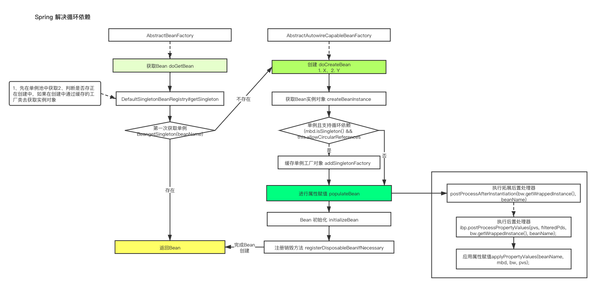

# Spring 循环依赖

### spring bean

* 需要存在容器中，可以在容器中 ``getBean`` 方法获取
* Spring 可以管理它的生命周期

### 三级缓存

* singletonObjects，单例只能被实例化一次，所以需要单例池，原型模式则不需要。
* singletonFactories ， 缓存的是一个工厂，主要是解决循环依赖。利用策略+工厂模式，生成了一个合格的Bean。
* earlySingletonObjects，解决性能问题。

### Autowired 解决循环依赖的过程

