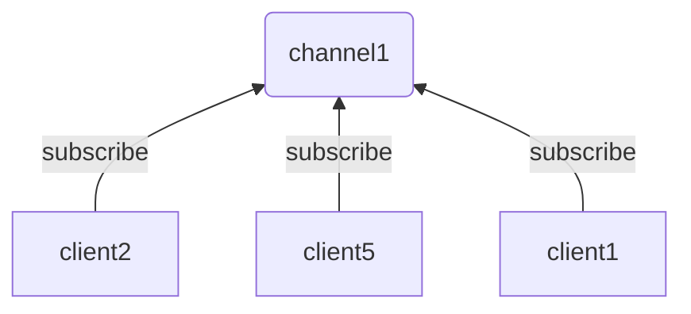
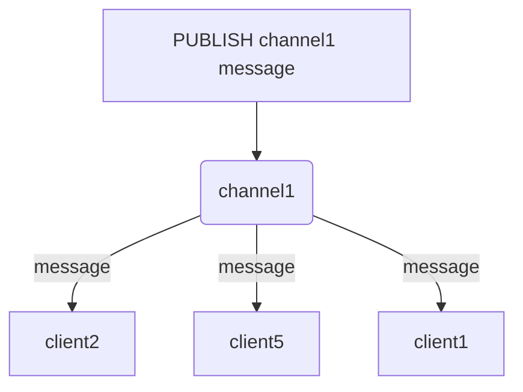

```mermaid
graph BT
A(channel1)
   C[client2] -- subscribe --> A
   D[client5] -- subscribe --> A
   E[client1] -- subscribe --> A 
```

```mermaid
graph TB
Z[PUBLISH channel1 message]
Z --> A(channel1)
  A -- message --> C[client2]
  A -- message --> D[client5]
  A -- message --> E[client1] 
```

