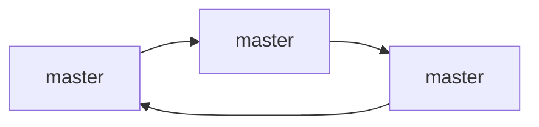

### MySql 集群模式

集群不能替代主动备份。

* 一主一从 （master/slave）

  ```mermaid
  graph LR;
  1[master] --> 2[slave]
  ```

  

* 一主多从（一般从节点2-4个，1-3个用来做查询业务，一个节点用来慢查询（报表/JOB/线上问题排查））

  ```mermaid
  graph LR;
  1[master] --> 2[slave]
  1 --> 3[slave]
  ```

  

* 双主 （数据进行取模，基数结果存储在 master1 , 偶数结果存储在 master2）

* 级联同步 

  ```mermaid
  graph LR;
  1[master] --> 2[slave]
  2 --> 3[slave]
  2 --> 4[slave]
  ```

  

* 环型多主



### 通过中间件来实现主/从架构

